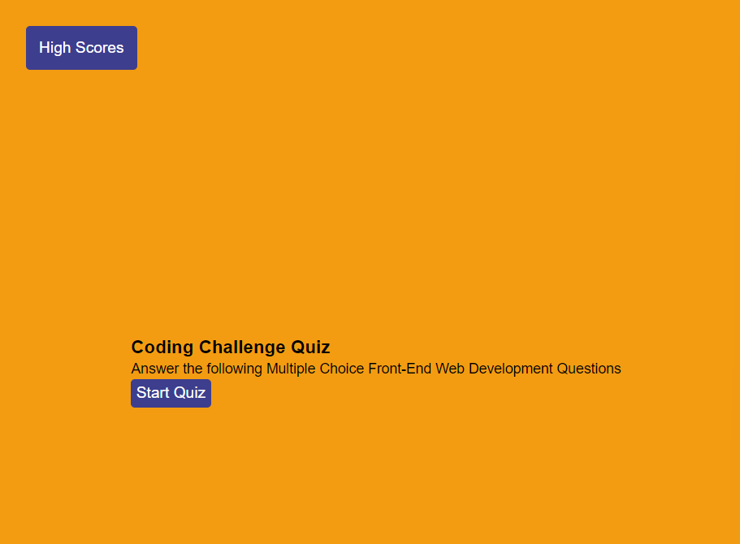
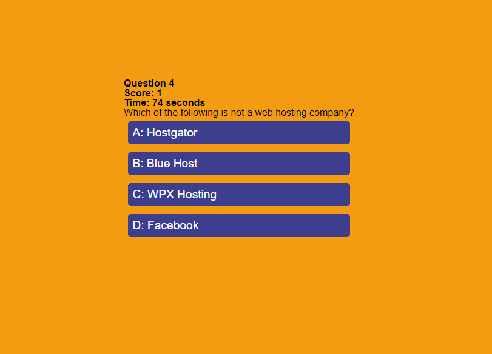
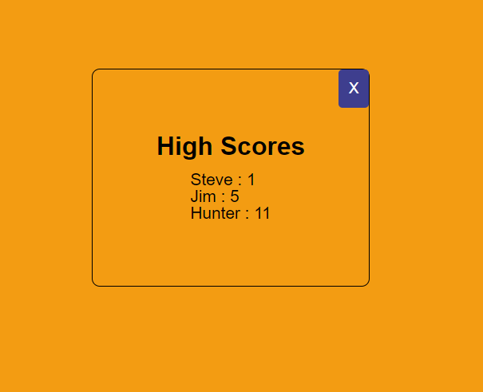

# Challenge-04-Coding-Quiz

Challenge 4 for Georgia Tech Coding bootcamp. A quiz with Web Development Questions that saves scores to Local Storage.

## Purpose

This quiz can be used to test one's knowledge of basic Web Development Concepts. The user can answer a series of questions and must do so within the given time period. He/she can then record the score and it will be saved in local storage to be viewed at a later time.

## Instructions

The user selects start quiz and then a series of questions will populate along with a timer that counts down to zero. Each time the user answers one of the multiple choice questions, another appears. If the user answers the question correctly, a point is added to the total score. If the user answers the question incorrectly, 10 seconds are subtracked from the time remaining. Once either the total number of questions or the time runs out, the quiz is over and the user can save his/her score into a high scores modal. The user can then select high scores to view previous scores. All scores are saved to local storage.

## Deployed Site

```bash
https://huntersteffner.github.io/Fully-Functioning-Quiz/

```

## Main Menu



## Quiz



## High Scores



## Contributing

This project can be cloned and referenced as inspiration in creating another portfolio webpage. Please only use as a reference.
